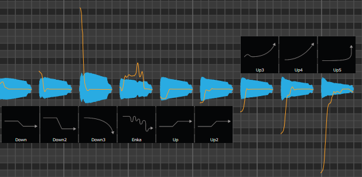
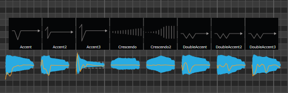
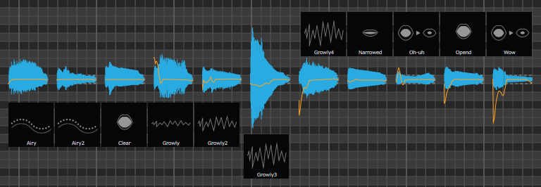
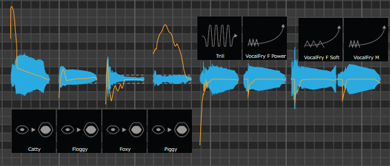
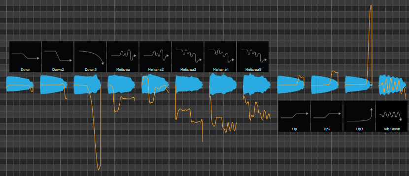
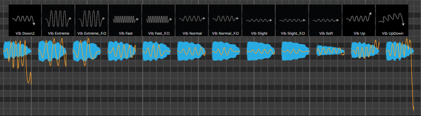
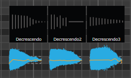
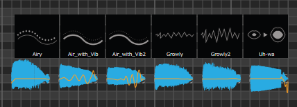
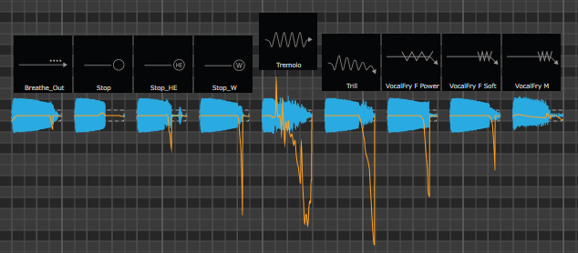

# VOCALOID5-Tutorial
VOCALOID5に慣れるためのメモ

## ATTACK EFFECT
### PITCH
 
<audio src="sound/attack_pitch.mp3" controls></audio> 
### DYNAMICS
 
<audio src="sound/attack_dyn.mp3" controls></audio> 
### TONE
 
<audio src="sound/attack_tone.mp3" controls></audio> 
### ORNAMENTATION
 
<audio src="sound/attack_ornam.mp3" controls></audio> 

## RELEASE EFFECT
### PITCH
 
<audio src="sound/rel_pitch_1.mp3" controls></audio> 
 
<audio src="sound/rel_pitch_3.mp3" controls></audio> 
### DYNAMICS
 
<audio src="sound/rel_dyn.mp3" controls></audio> 
### TONE
 
<audio src="sound/rel_tone.mp3" controls></audio> 
### ORNAMENTATION
 
<audio src="sound/rel_ornam.mp3" controls></audio> 